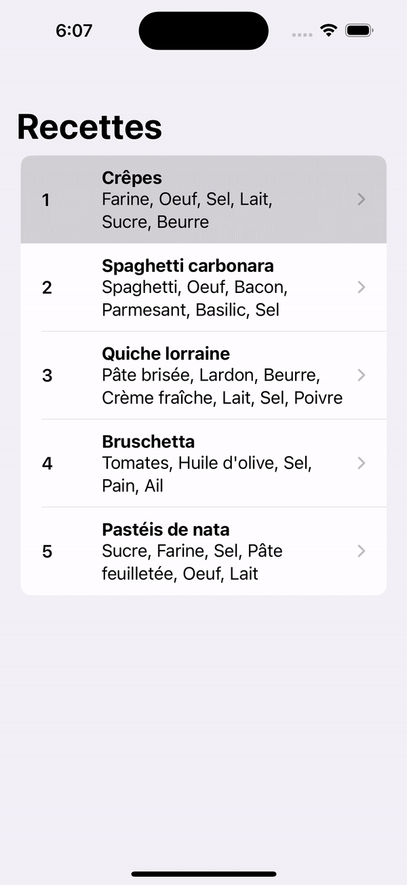

# Recipe iOS App

## À propos du projet

L'application Recipe est une application iOS écrite en Swift. Elle se connecte à une API locale pour récupérer une liste de recettes et les affiche dans une liste à l'utilisateur.

## Lancement de l'API (Node.js / Express)

Pour lancer l'API, vous aurez besoin de Node.js et d'Express. Suivez les étapes ci-dessous :

- Installer Express : `npm install express`
- Lancer l'API : `node api.js`

L'API sera lancée et écoutera sur le port 9191. Vous pouvez y accéder via [http://localhost:9191/](http://localhost:9191/)

## Utilisation de l'application
- Ouvrez le dossier `Recipes/`
- Lancez `Recipes.xcodeproj` avec Xcode
- Démarrez l'émulateur pour voir l'application en action

## Demo
